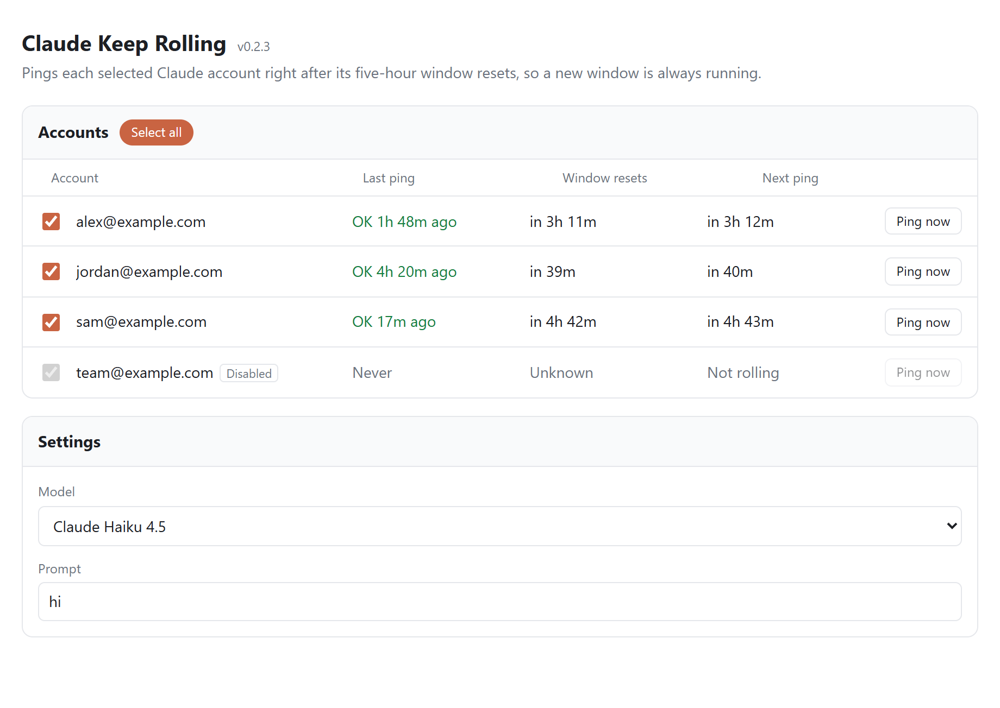

# Claude Keep Rolling

[](https://github.com/265866/claude-keep-rolling/actions/workflows/ci.yml)
[](https://github.com/265866/claude-keep-rolling/releases/latest)

A [CLIProxyAPI](https://github.com/router-for-me/CLIProxyAPI) plugin that keeps Claude five-hour usage windows rolling.

A Claude usage window starts with the first message and resets five hours later. This plugin sends a tiny message through each selected Claude account one minute after its window resets, so a new window is always running.

<picture>
  <source media="(prefers-color-scheme: dark)" srcset="docs/status-dark.png">
  
</picture>

## How it works

- Each ping goes through CLIProxyAPI's own Claude executor, pinned to one account.
- Claude's reply reports when the window resets. The next ping is scheduled one minute after that.
- A failed ping is retried after 15 minutes, or just after CLIProxyAPI's cooldown for the account ends if that is later.
- A ping is one short message with no tools, and the reply is capped at 1 token, so it uses almost none of the window.
- Disabled accounts and Claude API keys are skipped.
- Ping history is kept in memory. After CLIProxyAPI restarts, every selected account is pinged once to learn its reset time.

## Install

Requires CLIProxyAPI v8 with plugins enabled. Releases cover macOS (Apple Silicon and Intel), Linux (x64 and Arm) and Windows (x64).

### From the Plugin Store

Add this repository's registry to the store sources in `config.yaml`:

```yaml
plugins:
  enabled: true
  store-sources:
    - "https://raw.githubusercontent.com/265866/claude-keep-rolling/main/registry.json"
```

Then open **Plugin Store** in the Management Center and install **Claude Keep Rolling**.

### Manually

Download the zip for your platform from the [latest release](https://github.com/265866/claude-keep-rolling/releases/latest) and check it against `checksums.txt`. Put the library from the zip (`claude-keep-rolling.dylib`, `.so` or `.dll`) in your plugins directory, then enable it:

```yaml
plugins:
  enabled: true
  dir: "plugins"
  configs:
    claude-keep-rolling:
      enabled: true
```

## Use

Open **Claude Keep Rolling** in the Management Center sidebar.

- **Accounts**: check the accounts to keep rolling. **Select all** includes accounts you add later. Unchecking any account switches to only the accounts you have checked.
- **Settings**: the model and prompt for each ping. The model list shows the Claude models CLIProxyAPI offers. The default is Claude Haiku 4.5.
- **Ping now** sends a ping immediately. If it fails, the next scheduled ping still runs on time.

The page reuses the management key the Management Center saved if you logged in with **Remember password**. Otherwise it asks for the key and keeps it for the current tab only.

Disabling the plugin stops pings within 30 seconds. If your CLIProxyAPI config is not stored in a file, pings continue until CLIProxyAPI restarts.

## Configuration

The page saves its settings under the plugin's entry in `config.yaml`:

```yaml
plugins:
  configs:
    claude-keep-rolling:
      enabled: true
      model: claude-haiku-4-5-20251001  # default
      prompt: hi                         # default
      select_all: true                   # default
      accounts: []                       # account IDs, used when select_all is false
```

## Account risk

Anthropic restricts the use of Claude subscription logins through third-party tools. Using CLIProxyAPI with Claude accounts, and sending scheduled pings through them, may put those accounts at risk. Use it at your own discretion.

## Contributing

See [CONTRIBUTING.md](CONTRIBUTING.md) for building, testing and releasing.

## License

[MIT](LICENSE)
